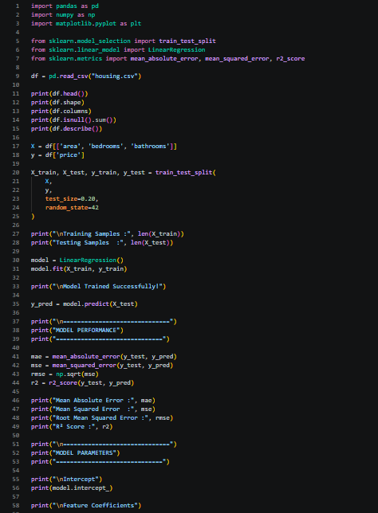
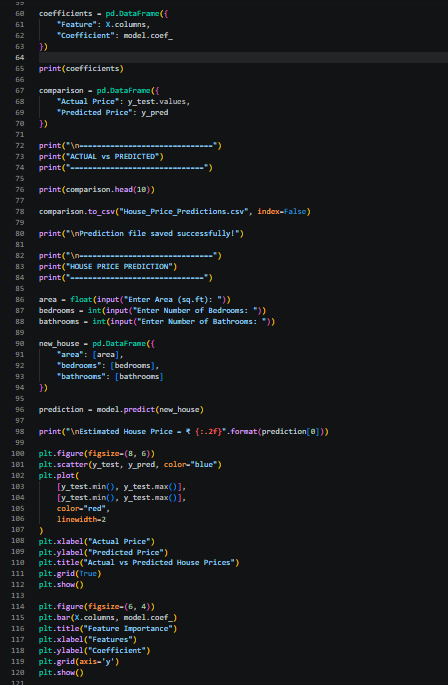
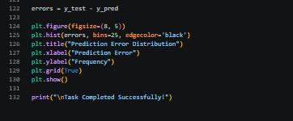
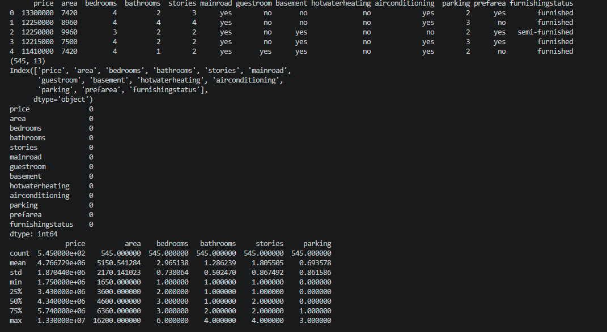
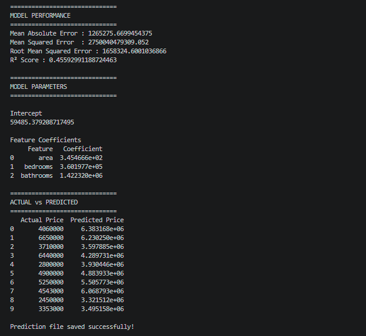
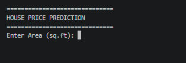

# 🏠 House Price Prediction using Linear Regression

## 📌 Project Overview

This project implements a **Linear Regression** model to predict house prices based on three important features:

- 📐 Area (Square Feet)
- 🛏️ Number of Bedrooms
- 🛁 Number of Bathrooms

The model is built using **Python** and **Scikit-learn**. It performs data preprocessing, trains a machine learning model, evaluates its performance, and predicts the price of a new house based on user input.

---

## 🎯 Project Statement

Implement a Linear Regression model to predict the prices of houses based on their square footage, number of bedrooms, and number of bathrooms.

---

## 🛠️ Technologies Used

- Python
- Pandas
- NumPy
- Matplotlib
- Scikit-learn
- VS Code

---

## 📂 Project Structure

```
SCT_ML_1/
│
├── Housing.csv
├── House_Price_Predictions.csv
├── house_price_prediction.py
├── README.md
├── requirements.txt
└── images/
    ├── code1.png
    ├── code2.png
    ├── code3.png
    ├── output1.png
    ├── output2.png
    └── output3.png
```

---

## 📊 Dataset

The dataset (`Housing.csv`) contains information about houses with the following features:

- Area (Square Feet)
- Number of Bedrooms
- Number of Bathrooms
- House Price

---

## ⚙️ Workflow

The project follows these steps:

1. Import required libraries.
2. Load the housing dataset.
3. Perform basic data analysis.
4. Select input features and target variable.
5. Split the dataset into training and testing sets.
6. Train a Linear Regression model.
7. Evaluate the model using different performance metrics.
8. Save the predicted house prices to a CSV file.
9. Accept user input for a new house.
10. Predict the estimated house price.
11. Visualize the model results using graphs.

---

## 📈 Model Evaluation Metrics

The following metrics are used to evaluate the model:

- Mean Absolute Error (MAE)
- Mean Squared Error (MSE)
- Root Mean Squared Error (RMSE)
- R² Score

---

## 📷 Project Screenshots

### Code







---

### Output

#### Dataset Information



#### Model Performance



#### Prediction and Graphs



---

## ▶️ How to Run the Project

### Clone the Repository

```bash
git clone https://github.com/nandithamuppalla/SCT_ML_1.git
```

### Navigate to the Project Folder

```bash
cd SCT_ML_1
```

### Install Required Libraries

```bash
pip install -r requirements.txt
```

### Run the Program

```bash
python house_price_prediction.py
```

---

## 💻 Sample Prediction

```
Enter Area (sq.ft): 2500
Enter Number of Bedrooms: 3
Enter Number of Bathrooms: 2

Estimated House Price = ₹ 8,450,000.00
```

*(The predicted value depends on the dataset used.)*

---

## 📊 Visualizations

The project generates the following graphs:

- Actual vs Predicted House Prices
- Feature Importance (Regression Coefficients)
- Prediction Error Distribution

---

## 📁 Output File

After execution, the program creates:

```
House_Price_Predictions.csv
```

This file contains the actual and predicted house prices for the test dataset.

---

## 📦 Requirements

Install all required libraries using:

```bash
pip install -r requirements.txt
```

**requirements.txt**

```
numpy
pandas
matplotlib
scikit-learn
```

---

## 🎓 Learning Outcomes

- Data preprocessing using Pandas
- Training a Linear Regression model
- Model evaluation using performance metrics
- Making predictions on new data
- Data visualization with Matplotlib
- Exporting predictions to a CSV file

---

## 👩‍💻 Author

**Muppalla Nanditha**

GitHub: https://github.com/nandithamuppalla

---

## 📜 License

This project is developed for educational and internship purposes under the SkillCraft Technology Machine Learning Internship.